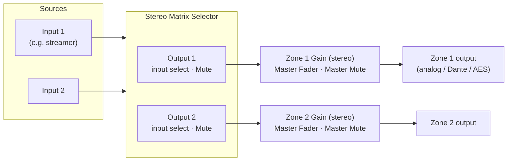

# Composer setup

How to lay out a Symetrix Composer site file so this integration can control it.
The integration needs, for every **zone** (a room or speaker pair):

| Feature in Home Assistant | Composer control it drives |
| --- | --- |
| Power on/off | the zone output's **Mute** on a Matrix Selector |
| Source | the zone output's **input selection** on the same Matrix Selector |
| Volume | the **Master Fader** of the zone's Gain module |
| Mute | the **Master Mute** of the zone's Gain module |

Each of those controls gets a **control number** with **Push** enabled. Nothing
else in the design matters to the integration: you can add EQ, dynamics,
crossovers, delays and so on anywhere in the chain.

## Signal flow



- **Sources** are whatever input modules feed the selector: analog inputs,
  Dante *Network Rx* channels, USB, and so on.
- **One Matrix Selector** serves every zone. Use the **Stereo** version for
  stereo zones; size it to at least as many inputs as you have sources and as
  many outputs as you have zones.
- **One Gain module per zone**, after the selector. For stereo zones use a
  2-channel gain, which has a Master Fader and Master Mute that act on both
  channels. Name it after the zone (e.g. *Kitchen Vol*) so it is easy to find.
- Zone processing (EQ, limiter, crossover, delay) can sit before or after the
  Gain module. Keep speaker-protection limits *after* the Gain module so no
  volume setting can bypass them.

## Modules and settings

### Matrix Selector

*Toolkit → Routers & Selectors → Matrix Selectors.*

| Tab | What to set |
| --- | --- |
| Inputs | Name each input (for your own reference; Home Assistant uses its own source list). |
| Output 1…n | One output per zone. Each output has the input selection (Connect buttons plus a numeric display) and a **Mute** button. |

Notes:

- The integration uses the output **Mute** as zone power: muted = off. This
  stops the zone at the selector, so a zone that is "off" stays silent even if
  its volume is up.
- The input selection is sent as an **input index starting at 0**: Composer's
  *Input 1* is index 0, *Input 2* is index 1, and so on. Writing an index past
  the last input selects the last input.
- Assign the control number to the output's **input source** control (the
  numeric input display / input source list that Composer provides for
  remote source selection), not to an individual Connect button.

### Gain (per zone)

*Toolkit → Mixers & Gains → Gains*, 2 channels for a stereo zone.

- **Master Fader** — zone volume. The integration maps raw values linearly
  in dB across the fader's range. The default range used by the integration
  is **−72 dB to +12 dB**; if your fader's range differs, enter it under the
  integration's *Configure → Volume → Fader minimum / maximum*.
- **Master Mute** — zone mute, independent of power.
- Set the **channel faders** to 0 dB (or to whatever trim balances the
  zone); Home Assistant only moves the master.
- Home Assistant never sets the fader above its *Volume 100 %* level (0 dB by
  default). Use the channel faders or a downstream gain if a zone needs more
  headroom than that.

## Control numbers

Control numbers are how the integration addresses each control. Assign one
to a control by selecting it in the module and using
*Edit → Set Up Remote Control* (or right-click it), choosing a **control
number**. Review all of them in *Tools → Remote Control Manager → Control
Numbers*.

The integration's default layout is **type base + zone number**:

| Control | Base | Zone 1 | Zone 2 | Zone 3 | Values |
| --- | --- | --- | --- | --- | --- |
| Power (selector output Mute) | 2000 | 2001 | 2002 | 2003 | 65535 = off, 0 = on |
| Source (selector output input select) | 2100 | 2101 | 2102 | 2103 | input index 0, 1, … |
| Volume (Gain Master Fader) | 2200 | 2201 | 2202 | 2203 | 0…65535 across the fader range |
| Mute (Gain Master Mute) | 2300 | 2301 | 2302 | 2303 | 65535 = muted, 0 = unmuted |

Zone numbers can go up to 100. Any other numbering works: change the bases
under *Configure → Control numbers*, or give a zone explicit control numbers
in its *Overrides*. A zone can also leave out any of the four controls (untick
it in the zone's *Controls*), and the media player simply drops that feature.

Keep the numbers out of 2400–2999 if you can: future versions plan to use
that range for per-zone tone controls and meters.

## Enable Push

The integration relies on the DSP *pushing* changes, so changes made in
Composer, on a touchscreen or by another controller show up in Home
Assistant within a second.

1. Open *Tools → Remote Control Manager → Control Numbers*.
2. Select all the zone control numbers (shift-click / ctrl-click).
3. Click **Enable Push** (the button reads *Disable Push* when push is
   already on).

Without push, Home Assistant still works but only notices outside changes at
its periodic resync (every 5 minutes by default).

## Push to the hardware

Send the site file to the DSP (go online and push the design) after any of
the above changes. Then, from the integration page in Home Assistant, reload
the integration, or add it if this is the first time.

## Network

- The integration connects to the DSP's **control** Ethernet port on TCP
  **48631**. On Dante models, this is a different IP address from the Dante
  interface — use the control port's address.
- The DSP accepts several control connections at once, so the integration
  can run alongside other control systems and test tools.

## Checklist

- [ ] One Stereo Matrix Selector, one output per zone, inputs wired to your sources.
- [ ] One 2-channel Gain module per zone after its selector output.
- [ ] Control numbers on: selector output Mute, selector output input select,
      Gain Master Fader, Gain Master Mute — for every zone.
- [ ] Push enabled on all of them.
- [ ] Site file pushed to the DSP.
- [ ] Integration added in Home Assistant with the control IP; sources listed
      under *Configure → Sources* in the selector's input order, starting at 0.

## Verifying

From a checkout of this repository you can read every zone control without
changing anything:

```sh
tools/prism_test.py --host <control-ip> --zones 1 2 --read-only
```

Every control should show a value. `-0001 (unassigned)` means the control
number is not assigned in the site file (or the site file was not pushed).
When adding the integration, Home Assistant performs the same check and warns
about unassigned control numbers.
